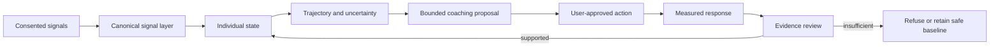

# Architecture overview

This is a deliberately abstract view. It shows the separation of responsibilities without publishing internal contracts, domain names, thresholds, event taxonomies or production topology.

## The closed loop



## Authority is separated on purpose

| Responsibility | May do | Must not do |
|---|---|---|
| Signal layer | Normalise consented inputs and retain provenance | Decide what a user should do |
| Individual model | Estimate state and uncertainty | Invent missing evidence |
| Experiment layer | Define and evaluate bounded comparisons | Release an under-powered conclusion |
| Coaching layer | Present structured, state-aware support | Override safety or consent |
| Population learning | Offer reviewed advisory priors | Mutate an individual's state |
| Language layer | Explain bounded structured outputs | Own state, safety or causal authority |
| Governance layer | Suppress, cap, audit and roll back influence | Be bypassed by another layer |

## Runtime precedence

When objectives conflict, authority runs in one direction:

```text
Safety and consent
        ↓
Data quality and confidence
        ↓
Individual evidence
        ↓
Reviewed population evidence
        ↓
Presentation and language
```

Lower layers can express an authorised result. They cannot overrule a higher layer.

## Deterministic where it matters

Probabilistic methods are useful for estimation and forecasting. They are not a reason to make every boundary probabilistic.

Consent, eligibility, minimum evidence, safety suppression, influence caps, audit requirements and rollback are deterministic controls. A probabilistic output passes through them; it does not redefine them.

## Why this architecture is interesting

The difficult part of an adaptive system is not generating another recommendation. It is maintaining one coherent account of:

- what the system knew at the time;
- what it believed and how uncertain it was;
- what it proposed;
- what the user chose;
- what happened next;
- whether the evidence justified learning from it;
- how that influence can be withdrawn.

That decision-to-outcome lineage is the foundation for accountable adaptation.
